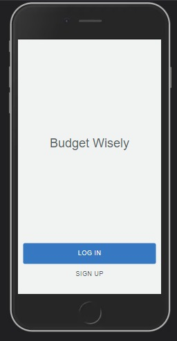
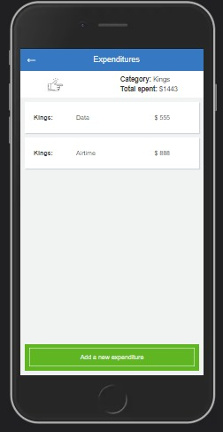
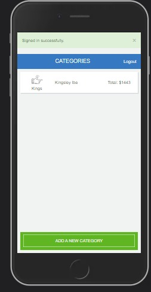
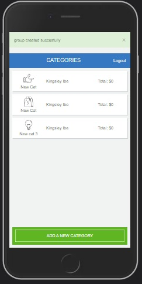

# Recipe App

The Ruby on Rails capstone project is a mobile web application where you can manage your budget: you have a list of transactions associated with a category, so that you can see how much money you spent and on what.

The application allows the user to:

- Register and log in, so that the data is private to them.
- Introduce new transactions associated with a category.
- See the money spent on each category.

#### Budget App Screenshots

<table>
  <tr>
    <td>Mobile Home Page</td>
     <td>New Category List</td>
     <td>Expenditure List Page</td>
     <td>Category List Page</td>
  </tr>
  <tr>
    <td></td>
    <td></td>
    <td></td>
    <td></td>
  </tr>
 </table>

[Live video Demo](https://vimeo.com/701801323/bb1bd337d4)
[Live project Demo](https://budget-app-003.herokuapp.com/)
# Getting Started


_To get a local copy up and running follow these simple steps._

1. Clone the repo
   ```sh
   git clone https://github.com/KingsleyIbe/budget-app.git
   ```
2. Goto project directory
   ```sh
   cd budget-app
   ```

3. Configure `database.yml` in the config folder according to your postgreSQL configuration
4. Run app
   ```sh
   rails server
   ```
   or
   ```sh
   rails s
   ```


# Testing

`bundle exec rspec` will run all the tests.

Also, you can run `bundle exec rspec spec/` to run specific tests.

You can also run `RAILS_ENV=test rspec spec/` to run the tests in test mode.

## Errors

If you encounter any errors, run the following commands.

- Run `rails db:drop db:create db:migrate` to drop, create and migrate a new database.

- Run `rubocop && rubocop -A` to check for and fix code errors.

# This project was built with

- Ruby on Rails

- PostgreSQL

- Bootstrap CSS Framework

# Author

👤 **KingsleyIbe**

- GitHub: [KingsleyIbe](https://github.com/KingsleyIbe)

- Twitter: [Twitter](https://twitter.com/ibekingsley2)

- LinkedIn: [LinkedIn](https://www.linkedin.com/in/kingsley-ibe/)

# 🤝 Contributing

Contributions, issues, and feature requests are welcome!

Feel free to check the [issues page](https://github.com/KingsleyIbe/budget-app/issues).

# Show your support

Give a ⭐️ if you like this project!

# Acknowledgement

- Hat tip to anyone whose code was a source of inspiration.
- A big thanks to [microverseinc](https://github.com/microverseinc).
- [Gregoire Vella](https://www.behance.net/gregoirevella) on Behance the author of the [original design](https://www.behance.net/gallery/19759151/Snapscan-iOs-design-and-branding?tracking_source=)

# 📝 License

This project is [MIT](./MIT.md) licensed.